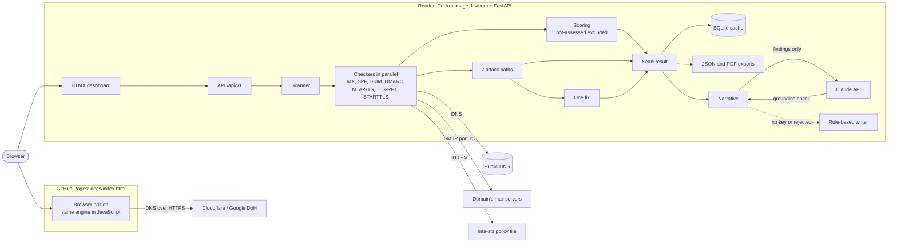

# SecureMailScope

**Find out in seconds whether attackers can send email as your domain, and get the one DNS change that fixes the most.**

SecureMailScope audits a domain's email security (SPF, DKIM, DMARC, MTA-STS, TLS-RPT, MX and live STARTTLS), turns the findings into a 0–100 score, maps them onto **seven concrete attack paths**, and names the **single highest-impact fix**, including the exact DNS record to publish.

## Live demo

| | Link |
|---|---|
| **Browser edition** (no install, runs entirely in your browser) | **https://yojan-ui.github.io/SECUREMAILSCOPE/** |
| **Server edition** (FastAPI, all seven checks, PDF reports, Claude narrative) | [](https://render.com/deploy?repo=https://github.com/Yojan-ui/SECUREMAILSCOPE) |

It ships in two editions that share one scoring engine:

| | **Server edition** (FastAPI) | **Single-file edition** (`offline_scanner.html`) |
|---|---|---|
| Install | Python 3.11+, `pip install` | None: open the file in a browser |
| Checks | All 7, including a live STARTTLS probe of the mail server | 6 of 7 (browsers can't open SMTP connections) |
| Output | Dashboard, plain-English narrative, JSON API, JSON and **PDF audit report** | Dashboard, JSON download, print to PDF |
| Where it runs | Any machine or server | Anywhere a browser runs, including locked-down laptops |

---

## Contents

1. [Try it in two minutes](#1-try-it-in-two-minutes)
2. [The problem](#2-the-problem)
3. [What you get from a scan](#3-what-you-get-from-a-scan)
4. [Running the FastAPI backend](#4-running-the-fastapi-backend)
5. [Using the single-file edition](#5-using-the-single-file-edition-offline_scannerhtml)
6. [How it works](#6-how-it-works)
7. [API reference](#7-api-reference)
8. [Testing and verification](#8-testing-and-verification)
9. [Deployment](#9-deployment)
10. [Project layout](#10-project-layout)
11. [Limitations](#11-limitations)

---

## 1. Try it in two minutes

**Fastest (no install):** open the [browser edition](https://yojan-ui.github.io/SECUREMAILSCOPE/), or double-click `offline_scanner.html`, type a domain (or click one of the examples), and press **Scan domain**.

**Full edition:**

```bash
python3 -m venv .venv && source .venv/bin/activate      # Windows: .venv\Scripts\activate
pip install -r requirements.txt
uvicorn app.main:app --reload
```

Open **http://localhost:8000**, scan `github.com`, then click **Download PDF report**.

---

## 2. The problem

Email is still the easiest way into an organisation. Phishing, invoice fraud and CEO impersonation all depend on one thing: a receiving mail server accepting a message that *claims* to come from a trusted domain.

The protocols that stop this (SPF, DKIM, DMARC, MTA-STS) already exist, but in practice they are:

- **Misconfigured silently.** An SPF record over its 10-lookup limit, or a DMARC policy left at `p=none`, looks like protection but blocks nothing.
- **Hard to interpret.** Existing checkers print a list of pass/fail rows and leave the administrator to work out what an attacker can actually do.
- **Hard to prioritise.** With ten warnings on screen, which one matters?

SecureMailScope answers the three questions an administrator actually has: *How bad is it? What can an attacker do? What do I fix first?*

---

## 3. What you get from a scan

### A score you can trust

A 0–100 score and A–F grade, weighted by how much each control matters:

| Control | Weight | Why |
|---|---|---|
| DMARC | **30** | The only control that tells receivers to *reject* forged mail. SPF and DKIM produce a verdict; DMARC acts on it. |
| Transport (STARTTLS) | **25** | Missing or broken encryption on the mail server exposes every inbound message. |
| SPF | **20** | Lists the servers allowed to send for the domain. |
| DKIM | **15** | Signs mail so tampering and forgery are detectable, and keeps DMARC working through forwarding. |
| MTA-STS | **7** | Stops attackers stripping encryption from inbound mail. |
| TLS-RPT | **3** | Reports delivery encryption failures to you. |

MX records are checked and reported but not scored. Pass earns full weight, weak (warn) earns half, fail or missing earns nothing. Grades: **A** ≥ 90, **B** ≥ 80, **C** ≥ 65, **D** ≥ 50, **F** below.

**Honest degradation.** A control the scanner *cannot measure* is marked **not assessed** and removed from the denominator. It is never scored as a failure. Examples:
- Outbound port 25 is blocked (common on cloud hosts and campus networks). The scanner first checks whether it can reach a known-good mail server; if it can't, the problem is on the scanner's side, not the domain's.
- DKIM keys live at secret "selectors" that can't be listed through DNS. Finding nothing at common selectors isn't proof DKIM is missing, so the scanner asks you for your selector instead of guessing.
- A domain that publishes a null MX (receives no mail) doesn't need MTA-STS or TLS-RPT.

### Seven attack paths

Every finding is translated into what an attacker can do. Each path is rated **Open**, **Partly open**, **Defended** or **Not measured**:

| # | Attack path | Impact | Decided by |
|---|---|---|---|
| 1 | **Exact-domain spoofing:** mail with your exact domain in the From: header | Critical | DMARC `p=` (with SPF and DKIM as alignment sources) |
| 2 | **Subdomain spoofing:** mail from invented subdomains such as `billing.yourdomain` | High | DMARC `sp=` |
| 3 | **Envelope sender spoofing:** any server claims to send for you at the SMTP level | High | SPF and its `all` qualifier |
| 4 | **Tampering and forwarding breakage:** unsigned mail can be altered, and fails DMARC when forwarded | High | DKIM keys |
| 5 | **STARTTLS downgrade:** an on-path attacker strips encryption from inbound mail | Medium | MTA-STS mode |
| 6 | **Weak transport encryption:** no STARTTLS, legacy TLS or a bad certificate on the mail server | Medium | Live STARTTLS probe |
| 7 | **Undetected abuse:** spoofing and TLS failures happen without anyone being told | Low | DMARC `rua=` and TLS-RPT |

The dashboard shows these as a matrix: paths as rows, controls as columns. Each cell shows how well that control defends *that particular path*. For example, a DMARC record with `p=none; sp=reject` fails path 1 but defends path 2.

### The one fix

Instead of a to-do list, SecureMailScope names the single change that closes the most severity-weighted risk. It writes the record for you, preserving any existing tags, and shows the score gain:

```
Fix this first: Enforce your DMARC policy                        +34 points
TXT record at _dmarc.gmail.com
v=DMARC1; p=quarantine; sp=quarantine; rua=mailto:mailauth-reports@google.com
Closes or narrows: Exact-domain spoofing
```

### A plain-English narrative

Under the score, a **"What this means"** section explains the findings for a non-specialist: a summary, how an attacker would use each gap, and what to fix in order.

- With an `ANTHROPIC_API_KEY` configured, **Claude** (default model `claude-opus-5`) writes it from the scan's findings only.
- Every Claude response is **checked before it is shown**. It is rejected if it states a score or grade the engine didn't compute, cites a finding that doesn't exist, or proposes fixes when the engine found nothing wrong.
- A rejected response, a missing key, a timeout, a refusal or an API error all fall back to a built-in **rule-based writer**. The narrative never depends on a live API call, and the page always says who wrote it.

### Reports

- **PDF audit report** (server edition): executive summary, priority remediation, attack path assessment, control results with points, every finding with its recommendation, and a scope and methodology section. Every page carries a running header and page numbers.
- **JSON export** (both editions): the complete machine-readable result.

---

## 4. Running the FastAPI backend

### Requirements

- Python **3.11 or newer**
- Internet access for DNS. Outbound TCP port 25 is optional: without it, the STARTTLS check is reported as not assessed.

### Install and run

```bash
git clone https://github.com/Yojan-ui/SECUREMAILSCOPE.git
cd SECUREMAILSCOPE
python3 -m venv .venv
source .venv/bin/activate            # Windows: .venv\Scripts\activate
pip install -r requirements.txt
uvicorn app.main:app --reload
```

| URL | What it is |
|---|---|
| http://localhost:8000/ | Dashboard |
| http://localhost:8000/docs | Interactive API documentation (Swagger UI) |
| http://localhost:8000/api/v1/health | Health check |

To run on a network interface other than localhost: `uvicorn app.main:app --host 0.0.0.0 --port 8000`.

### Configuration

All settings are environment variables prefixed `SMS_`. `.env.example` lists every option with its default. To use a file:

```bash
cp .env.example .env
uvicorn app.main:app --env-file .env
```

The ones you are most likely to change:

| Variable | Default | Purpose |
|---|---|---|
| `SMS_SMTP_PROBE_ENABLED` | `true` | Set `false` where outbound port 25 is known to be blocked; the probe is then skipped rather than timing out. |
| `SMS_DNS_MODE` | `auto` | `auto` uses UDP port 53 and falls back to DNS-over-HTTPS if UDP is blocked; `udp` or `doh` forces one. |
| `SMS_CACHE_TTL_SECONDS` | `3600` | How long a scan is cached in `data/cache.sqlite3`. |
| `SMS_DNS_RATE_PER_SECOND` / `SMS_DNS_BURST` | `20` / `40` | Per-domain DNS rate limit, so a scan never floods a nameserver. |
| `ANTHROPIC_API_KEY` | unset | Enables Claude-written narratives. Without it the rule-based writer is used. |
| `SMS_LLM_MODEL` | `claude-opus-5` | Claude model for the narrative. |
| `SMS_LLM_PROVIDER` | `auto` | `auto` uses Claude only when a key is set; `none` never calls an LLM. |

---

## 5. Using the single-file edition (`offline_scanner.html`)

`offline_scanner.html` is the whole scanner (engine, scoring, attack paths, one-fix logic and user interface) in **one HTML file with all CSS and JavaScript embedded**. There are no dependencies, no build step and no server.

### How to use it

1. Open `offline_scanner.html` in Chrome, Edge, Firefox or Safari (double-click, or drag it into a browser window).
2. Enter a domain and press **Scan domain**. Optionally add your DKIM selectors, e.g. `google` or `selector1`.
3. Use **Download JSON** or **Print or save as PDF** to keep the result.

You can also link straight to a scan: `offline_scanner.html?domain=example.com`, or [yojan-ui.github.io/SECUREMAILSCOPE/?domain=example.com](https://yojan-ui.github.io/SECUREMAILSCOPE/?domain=example.com). It works from a USB stick, an email attachment or any static web host. `docs/index.html` is the copy GitHub Pages serves, and a test keeps it identical to `offline_scanner.html`.

### How it works without a backend

DNS records are fetched with **DNS-over-HTTPS** (RFC 8484 JSON API) from Cloudflare, with Google as automatic fallback. You can choose the provider in the form. These lookups are the page's only network requests. Nothing is uploaded or stored.

It needs an internet connection for DNS, but nothing needs to be installed and no data goes to a SecureMailScope server.

### What differs from the server edition

The browser engine is a line-for-line JavaScript port of the Python engine, and the test suite checks that both produce identical results (see [section 8](#8-testing-and-verification)). The browser itself imposes two limits:

| Check | Browser behaviour | Why |
|---|---|---|
| STARTTLS on the mail server | Always **not measured** | Browsers cannot open raw TCP connections to port 25. |
| MTA-STS policy file | Read when the domain's web server allows cross-origin requests; otherwise **not measured** | Browser security (CORS) blocks reading most third-party files. The MTA-STS DNS record is always checked. |

Both are excluded from the score, not counted as failures, so the browser score can differ from the server score for the same domain. For example, gmail.com scores **65 (C)** on the server, which reads its MTA-STS policy and tests STARTTLS, and **43 (F)** in the browser. There those two passing controls (32 points) drop out, so its `p=none` DMARC policy carries more of the remaining weight. Use the server edition when you need the full picture.

---

## 6. How it works



A scan runs every checker concurrently, then three pure functions turn the check results into the score, the attack-path matrix and the one fix. The browser edition runs the same pipeline in JavaScript, and the test suite requires both engines to produce identical results. The narrative sits after the engine and can only restate what it found.

**What each check verifies**

| Check | Standard | Highlights |
|---|---|---|
| MX | RFC 5321, RFC 7505 | presence, priorities, null MX, IP-address targets |
| SPF | RFC 7208 | recursive `include:`/`redirect=` walk, 10-lookup and 2-void-lookup limits, `all` qualifier, include loops, `ptr`, over-broad IP ranges |
| DKIM | RFC 6376, 8301, 8463 | probes your selectors plus 16 common ones; decodes keys for RSA size, Ed25519, SHA-1-only, testing mode, wildcard records |
| DMARC | RFC 7489 | all tags, organisational-domain fallback, `p=none`, `sp=none`, `pct<100`, external report authorisation |
| MTA-STS | RFC 8461 | TXT id, HTTPS policy fetch (no redirects, `text/plain`), mode, max_age, MX coverage |
| TLS-RPT | RFC 8460 | record and report URI schemes |
| Transport | RFC 3207 | STARTTLS on the primary MX: TLS version, cipher, certificate validity and expiry |

**Choosing the one fix.** Each open path adds its severity weight (critical 10, high 6, medium 3, low 1) to the control that would fix it, at full weight if open and half if partly open. The control with the most weight wins. Ties go to the fix with the larger score gain, which is measured by re-scoring the scan as if that control passed.

**Tech stack.** Python 3.11+, FastAPI, Pydantic 2, dnspython, httpx, cryptography, ReportLab, the Anthropic Python SDK, Jinja2, HTMX and Tailwind CSS. The single-file edition is vanilla JavaScript with no libraries.

---

## 7. API reference

Base path: `/api/v1`. Full interactive docs are at `/docs`.

| Method | Path | Description |
|---|---|---|
| `GET` | `/health` | Service status and version |
| `POST` | `/scan` | Scan a domain. Body: `{"domain": "...", "dkim_selectors": ["s1"], "force_refresh": false}` |
| `GET` | `/scan/{domain}` | Scan (or return the cached scan of) a domain |
| `GET` | `/scan/{domain}/json` | Download the scan as a JSON file |
| `GET` | `/scan/{domain}/pdf` | Download the formal PDF audit report |
| `GET` | `/scan/{domain}/narrative` | Plain-English summary, attack scenarios and ordered fixes; `source` says whether Claude or the rule-based writer wrote it |
| `GET` | `/recent` | Recently scanned domains |

Both export endpoints accept `?dkim_selectors=s1,s2`. Domains are normalised first, so `https://Example.com/path` and `user@example.com` both mean `example.com`. IP addresses are rejected with HTTP 422.

```bash
curl -s -X POST localhost:8000/api/v1/scan -H 'content-type: application/json' \
  -d '{"domain": "github.com"}' | python3 -m json.tool | head -40

curl -OJ localhost:8000/api/v1/scan/github.com/pdf      # saves securemailscope-github.com-YYYYMMDD.pdf
```

Key response fields: `score` (`score`, `grade`, `components`, `not_assessed`), `checks[]` (`status`, `summary`, `records`, `findings[]`), `attack_matrix[]` (all seven paths with `exposure`, `reason`, `control_exposure`), `attack_paths[]` (only the open or partly open ones) and `one_fix` (`title`, `action`, `host`, `record`, `closes`, `score_gain`).

---

## 8. Testing and verification

```bash
pip install -r requirements-dev.txt
pytest
```

The suite has **283 tests** and runs in a few seconds, **fully offline**. An autouse guard fails any test that tries to reach the network (other than loopback), so a passing run proves nothing depends on live DNS.

| Area | What is verified |
|---|---|
| End-to-end scenarios (`tests/fixtures/scenarios.json`) | Complete fake domains scanned through the real engine: an **unprotected domain → grade F** (all 7 paths open), a **fully hardened domain → grade A** (all 7 defended), and a **cloud host with port 25 blocked → grade A**, with transport excluded from the score, not deducted. Each scenario pins every check status and all seven path outcomes. |
| Attack paths (`tests/test_attack_paths.py`) | Every rule's every outcome: 47 cases, plus a check that each of the 7 paths can reach all 4 states. |
| Checkers | SPF lookup counting and loops, DKIM key parsing (512 to 3072-bit RSA, Ed25519), DMARC tags and inheritance, MTA-STS policy rules, and STARTTLS against a real local SMTP server with generated certificates. |
| Narrative (`tests/test_narrative.py`) | The rule-based writer on real scenarios, including the clean-domain case (no invented work) and not-assessed checks described as gaps. The grounding validator rejects wrong scores, wrong grades, unknown finding ids and invented issues. The Claude path is tested with a fake client for success, refusal, truncation, timeouts, rate limits and connection failure, all of which must fall back cleanly. |
| Deployment (`tests/test_deploy.py`) | The GitHub Pages copy is identical to `offline_scanner.html`, the Dockerfile and dev template pin the same Tailwind version, the image runs as a non-root user on `$PORT`, and the production stylesheet keeps every colour class the templates build at runtime. |
| Exports (`tests/test_exports.py`) | JSON and PDF endpoints, filenames, invalid input, deterministic PDF output, and escaping of hostile text inside the PDF. |
| **Browser edition parity** (`tests/test_offline_build.py`) | Extracts the engine from `offline_scanner.html`, runs it under Node.js on the same fixtures as the Python engine, and requires **identical** check statuses, findings, score, attack matrix and one fix across 10 scenarios. It also compares domain normalisation, DNS-over-HTTPS answer parsing, RSA key sizes, and that the HTML file loads nothing external. |

The parity tests need Node.js 18+ and are skipped if it is not installed.

---

## 9. Deployment

### Docker

```bash
docker build -t securemailscope .
docker run -p 8000:8000 -e ANTHROPIC_API_KEY=sk-ant-... securemailscope   # the key is optional
```

The image builds the dashboard's stylesheet with Tailwind's standalone CLI (no Node.js), installs only runtime dependencies, runs as an unprivileged user, listens on `$PORT` (default 8000) and has a health check on `/api/v1/health`.

### Render

`render.yaml` is a Render Blueprint. Click **Deploy to Render** above, or in the Render dashboard choose **New → Blueprint** and select this repository. Add `ANTHROPIC_API_KEY` when prompted if you want Claude-written narratives. Many hosting providers block outbound port 25; when that happens the STARTTLS check is reported as not assessed and left out of the score.

### GitHub Pages (browser edition)

`docs/index.html` is a copy of `offline_scanner.html`. To publish it: repository **Settings → Pages → Build and deployment → Deploy from a branch → `main` / `/docs`**. After changing `offline_scanner.html`, run `cp offline_scanner.html docs/index.html` (a test fails if you forget).

---

## 10. Project layout

```
offline_scanner.html   single-file edition (engine + UI, no dependencies)
docs/index.html        GitHub Pages copy of offline_scanner.html
Dockerfile, render.yaml, .dockerignore
requirements.txt       runtime dependencies (requirements-dev.txt adds pytest)
app/
  main.py              FastAPI app and dashboard route
  api/routes.py        JSON API, HTMX partials, JSON/PDF exports
  core/                settings (SMS_* env vars), constants, logging, SQLite TTL cache
  engine/
    checkers/          mx, spf, dkim, dmarc, mta_sts, tls_rpt, transport
    dns_resolver.py    domain normalisation, UDP/DoH resolver, rate limiting
    scanner.py         runs checkers in parallel and assembles the result
    scoring.py         weights, grades, not-assessed handling
    attack_paths.py    the seven attack path rules
    remediation.py     one-fix selection and DNS record generation
  models/              Pydantic schemas and enums
  narrative/           rule-based writer, Claude writer, grounding validator
  reports/pdf.py       PDF audit report (ReportLab)
  templates/, static/  Jinja2 + HTMX + Tailwind dashboard
tests/
  fixtures/            DNS zones and end-to-end scan scenarios
  js/                  Node harness for the single-file edition
  test_*.py
legacy/                earlier prototype, kept for reference (see below)
```

**`legacy/`** holds the first SecureMailScope prototype: an AI-written narrative layer with a
deterministic fallback (now ported into `app/narrative/`), a CLI, and scan history. It is a separate codebase with its own
`requirements.txt`, tests and scoring weights, and its design notes are in
`legacy/ARCHITECTURE-NOTES.md`. Everything else in this README describes the current edition at
the repository root.

**Extending it.** To add a check, subclass `BaseChecker` in `app/engine/checkers/`, implement `async check(ctx)`, and register it in `CHECKERS`. Weights live in `scoring.py` and attack path rules in `attack_paths.py`.

---

## 11. Limitations

- **Point-in-time.** A scan reflects DNS and mail server configuration at the moment it runs.
- **DKIM needs your selector** for a definitive verdict, because selectors cannot be discovered through DNS.
- **STARTTLS needs outbound port 25**, which many cloud providers and networks block. SecureMailScope detects this and excludes the check instead of guessing.
- **Organisational domain detection** uses a built-in list of common multi-part suffixes (such as `co.uk` and `co.in`) rather than the full Public Suffix List.
- **The browser edition cannot measure STARTTLS** (25 points) and usually cannot read MTA-STS policy files, so its score for the same domain can be noticeably lower or higher than the server's. Both editions exclude what they can't measure rather than guessing.
- **In local development the dashboard compiles Tailwind in the browser** from a CDN. The Docker image ships a prebuilt stylesheet instead.
